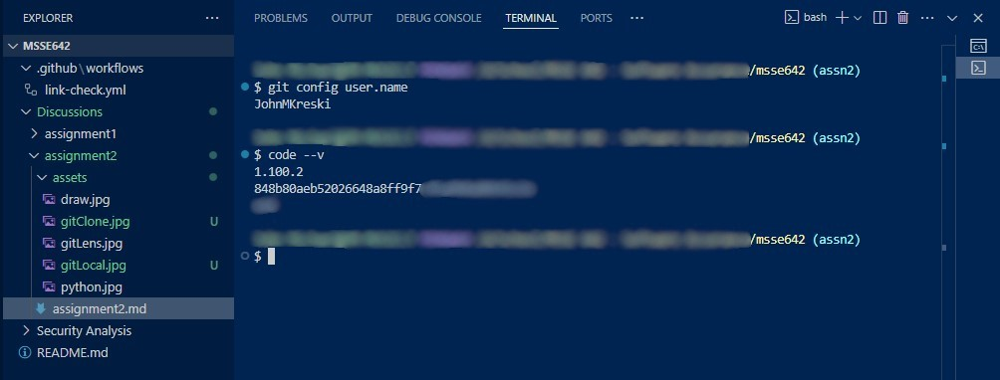
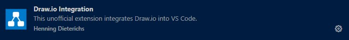
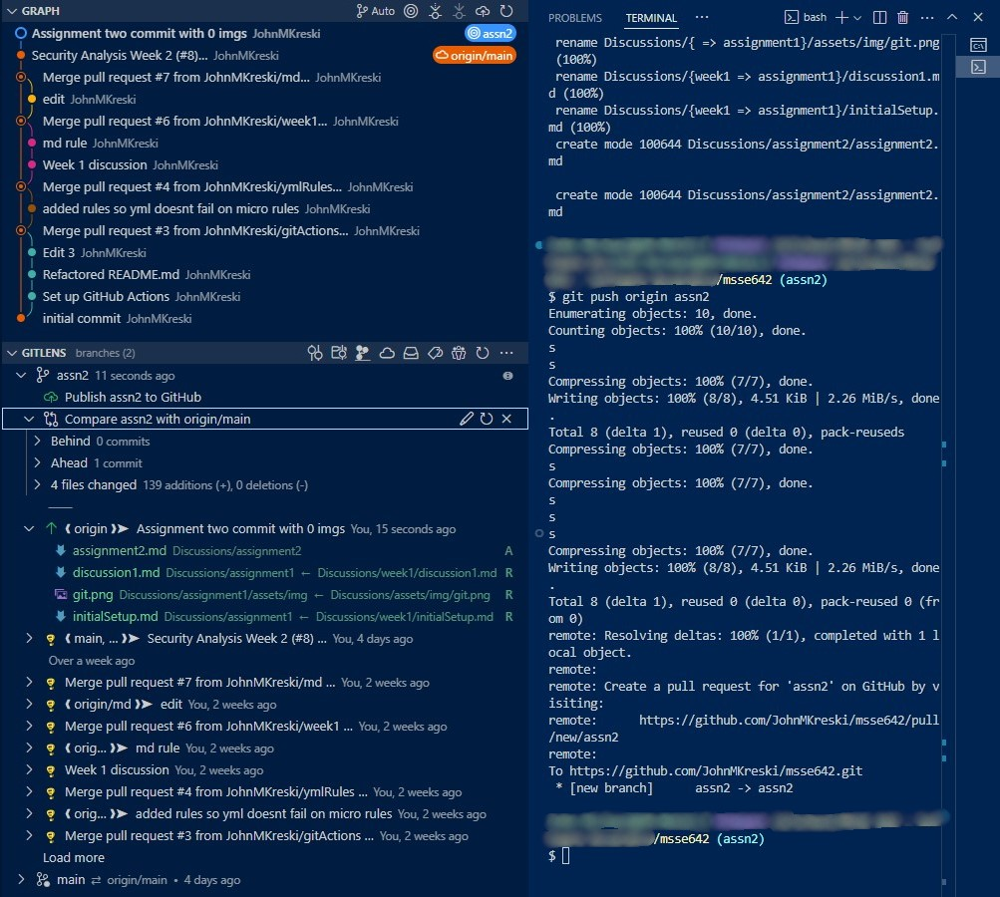
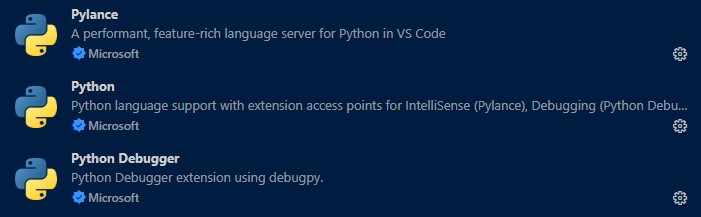
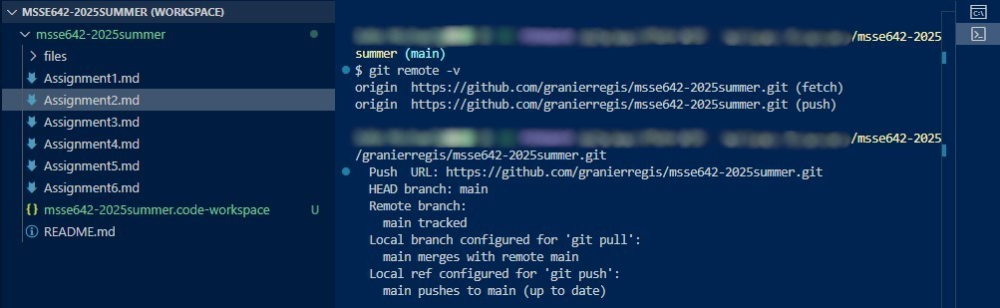
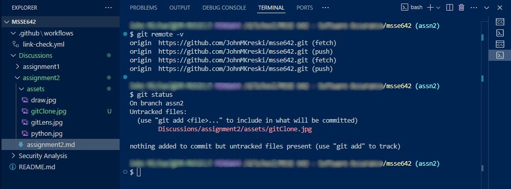

# Assignment 2

## Activity 1: Configure Visual Studio Code (VSC)

1. **VSC Local with Git Bash**
    - 

2. **Extensions**
    - **Draw.io** _Replacing Excalidraw_  
      
    - **Git Lens** _Shows Git history_  
      
    - **Python**  
      


## Activity 2

- **Cloned Class Repo**
  - 
- **Local Git-Project Repo**
  - 

## Activity 3

### Best Practices for a README.md file

A well-crafted `README.md` is essential for any project. It helps others understand the purpose, setup, and usage of your project. Here are some best practices:

#### 1. **Project Title and Description**
Begin with a clear project title and a concise description.

```markdown
# Project Name

A brief description of what the project does and its purpose.
```

#### 2. **Table of Contents**
For longer documents, include a table of contents for easy navigation.

```markdown
## Table of Contents

- [Installation](#installation)
- [Usage](#usage)
- [Contributing](#contributing)
- [License](#license)
```

#### 3. **Installation Instructions**
Provide step-by-step instructions for setting up the project.

```markdown
## Installation

1. Clone the repository:
   
   git clone https://github.com/username/project.git
   
2. Install dependencies:
   
   npm install
   
```

#### 4. **Usage Examples**
Show how to use the project with code snippets or screenshots.

```markdown
## Usage

To start the application, run:

    npm start
```

#### 5. **Contributing Guidelines**
Explain how others can contribute.

```markdown
## Contributing

Pull requests are welcome. For major changes, please open an issue first to discuss what you would like to change.
```

#### 6. **License**
State the license for your project.

```markdown
## License

[MIT](LICENSE)
```

#### 7. **Badges and Visuals**
Add badges (build status, license, etc.) and visuals (screenshots, diagrams) to enhance readability.

**Example:**

```markdown
## Badges


```

You can also include diagrams or workflow charts:

```markdown
## Architecture Diagram


```

#### 8. **Pictures and GIFs**
Including images or GIFs can make your README more engaging and easier to understand. Use screenshots to show your application's interface or GIFs to demonstrate features in action.

**Example:**

```markdown
## Screenshots


## Demo


```

- Store images in an `assets` or `images` folder within your repository.
- Use descriptive alt text for accessibility.
- Keep visuals up to date as your project evolves.

#### 9. **Handling Sensitive Information in Your Repository**
It is important to avoid sharing sensitive information (such as passwords, API keys, personal data, or confidential screenshots) in your README or any files committed to your repository.

**Best Practices:**
- **Review screenshots:** Before uploading, check for visible usernames, emails, file paths, or other private details. Crop or blur sensitive areas if needed.
- **Use `.gitignore`:** Add files containing secrets (like `.env` or `config.json`) to your `.gitignore` so they are not tracked by Git.
- **Environment variables:** Store secrets in environment variables or configuration files that are not committed to the repository.
- **Audit commits:** Double-check your commit history for accidental leaks of sensitive data.
- **Remove sensitive data:** If you accidentally commit sensitive information, remove it from your history using tools like `git filter-branch` or `BFG Repo-Cleaner`, and update any exposed credentials.

**Example of a `.gitignore` entry:**
```gitignore
# Ignore environment files with secrets
.env
config.json
```

---

**Summary:**  
A good `README.md` is clear, organized, and provides all the information needed for users and contributors. Use headings, lists, code blocks, links, and visuals to make it easy to read and navigate. Always protect sensitive information when sharing code or documentation publicly.

