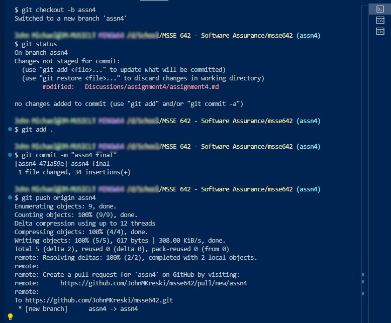
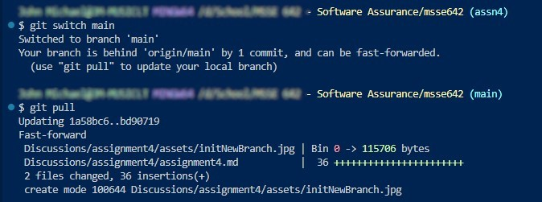
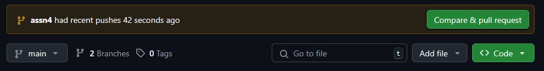
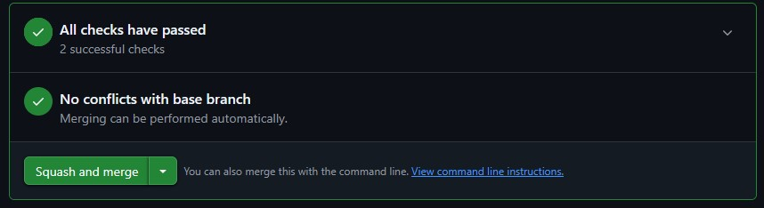
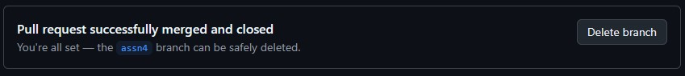

# Assignment 4 Workflow

## Branching and Cleanup Workflow

### 1. Create and switch to a new branch

```bash
git checkout -b assn4
```

### 2. Stage all changes

```bash
git add .
```

### 3. Push changes (Note: should push to 'assn4', not 'main')

```bash
git push origin assn4
```



### 4. Switch back to main and pull latest changes

```bash
git switch main
git pull
```



### 5. Delete local branch after merging or completing work

```bash
git branch -D assn4
```

## Git UI PR



