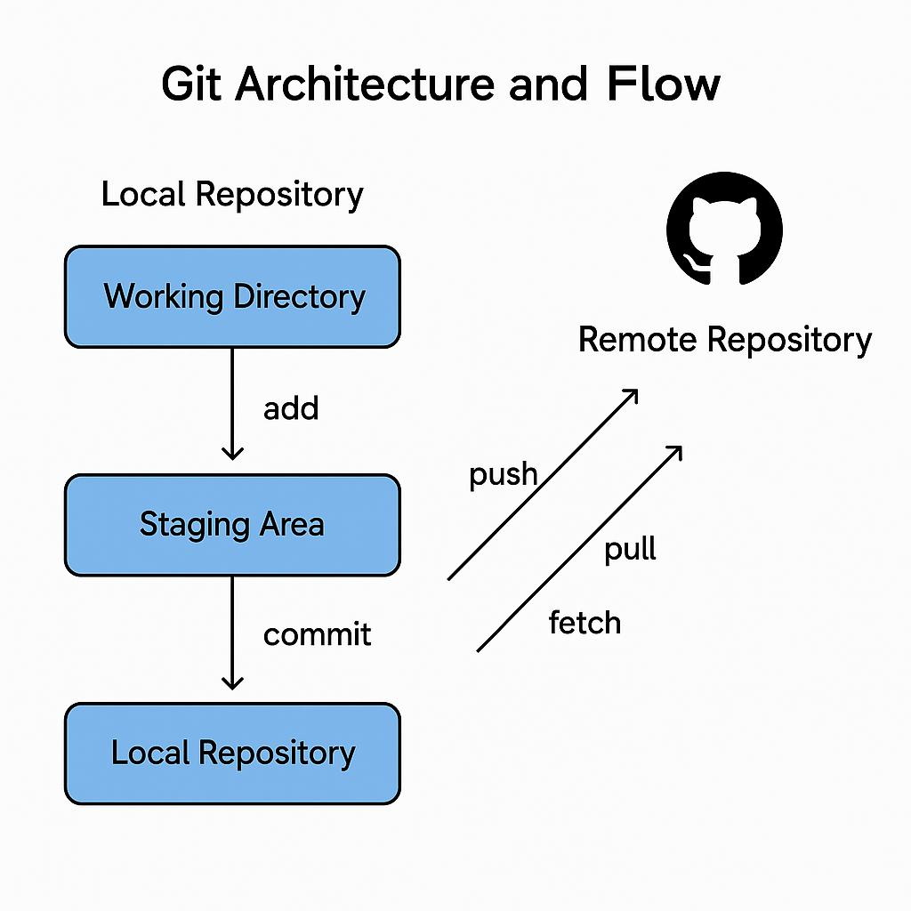

# MSSE-642-SUMMER

Ramesh KONDALA
MSSE-642 Software Engineering Leadership
May-04, 2025
 
Types of version control systems
There are two types of version control systems
Centralized Version Control system:
All version histories and files are stored on a single, central server. 
Developers check out files and commit changes directly to this central repository. 
Examples include Subversion (SVN) and CVS Distributed version control system.
Distributed Version Control Systems (DVCS):
Every developer has a complete copy of the repository, including the full history, on their local machine, also known as a local repository. 
Changes are committed locally and can later be synchronized (pushed or pulled) to a remote repository. 
Examples: Git, Mercurial.
What type is git?
Git is a distributed version control system (DVCS). This means that each user has a complete copy of the repository, including the full history on their local machine. This setup enables work to be done offline and supports powerful branching, merging, and collaboration workflows.
Snapshots:
A snapshot in version control is like a friendly record of how a project looks at a specific moment. In Git, when you make a commit, it takes a snapshot of all your files. This makes it super easy to go back to or compare with previous versions whenever you need! It’s important to note that this is a bit different from a backup. Snapshots help track the journey and changes in your project rather than just serving to restore your data.
What is a Repository?
A repository, or “repo,” is a data structure that holds all project files for a project, along with the entire history of modifications made to those files. It facilitates tracking, collaboration, and the recovery of earlier versions.
Local Repository:
Located on your personal computer.  
Where you code, commit changes, and manage modifications.  
It contains the `.git` folder, which includes all version history and metadata.
Remote Repository:
    •	Hosted on a server (e.g., GitHub, GitLab, Bitbucket).
    •	Used for sharing code with others and collaborating as a team.
    •	Acts as a central integration point for multiple developers.
What is a Commit?
A commit serves as a save point within your project. It a snapshots your files at a specific moment, accompanied by a message detailing the changes. Commits create the foundation of your project’s history, enabling you to revert or examine changes when necessary.
What is a Working Directory?
The working directory is the folder on your computer where you actively edit files. It represents the current state of your project as you view and work on it before changes are staged or committed.
What is the Staging Area?
The staging area (also called “index”) is a space where you collect changes you intend to include in your next commit. You add files to the staging area before committing, which allows you to control exactly which changes are recorded in each snapshot.
Diagram: Git Architecture and Workflow

