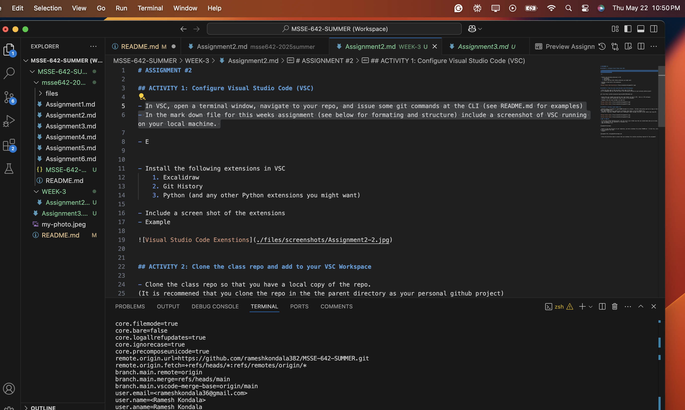
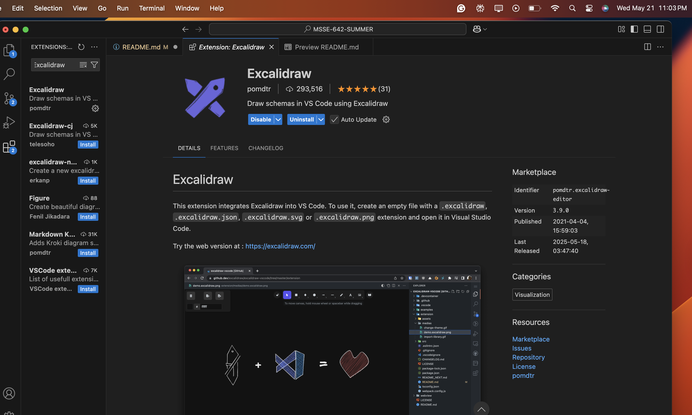
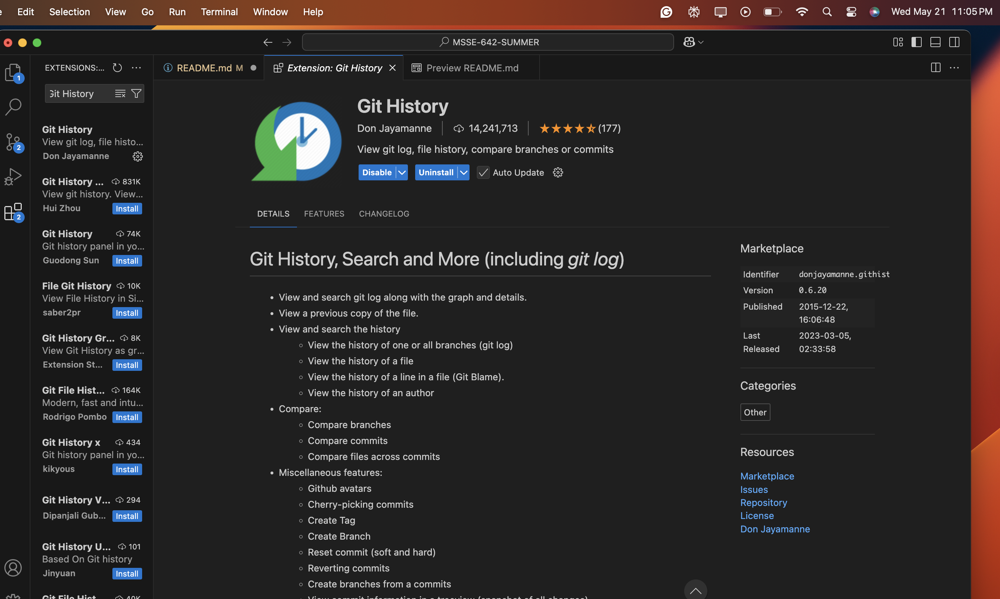
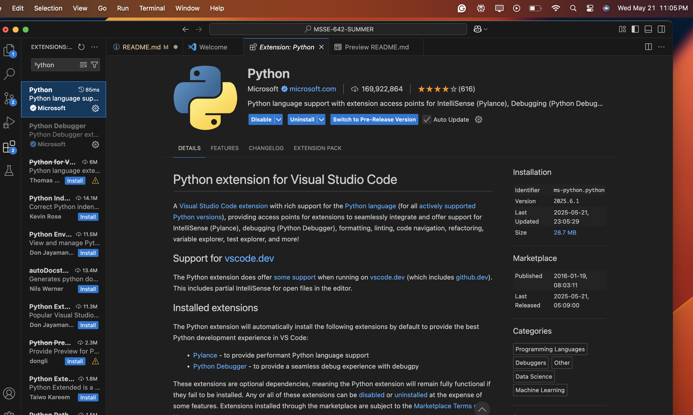
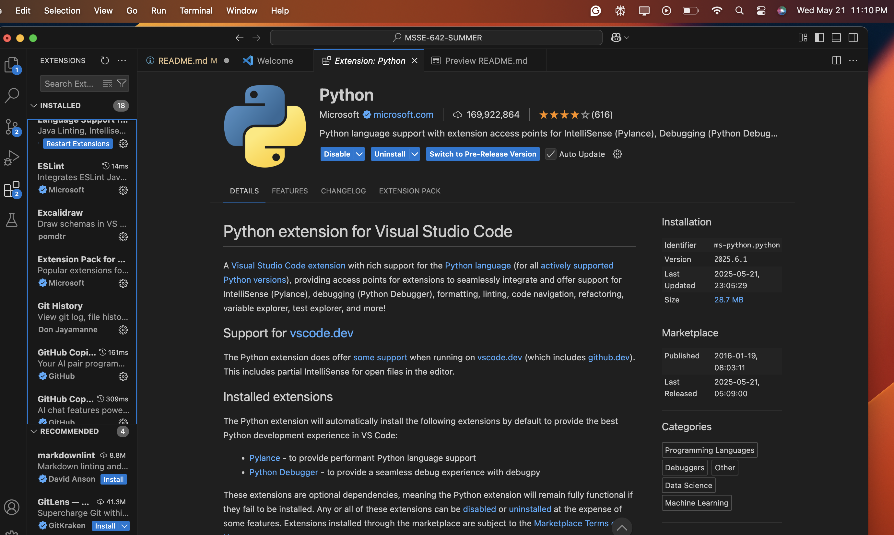
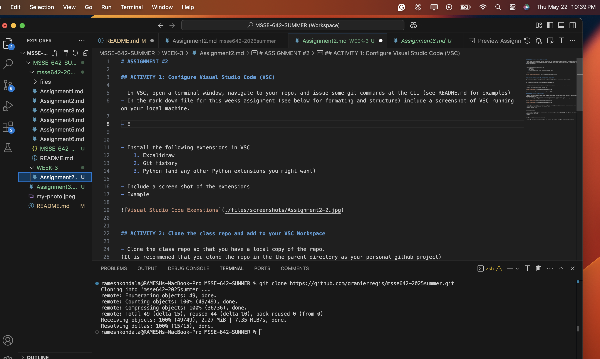
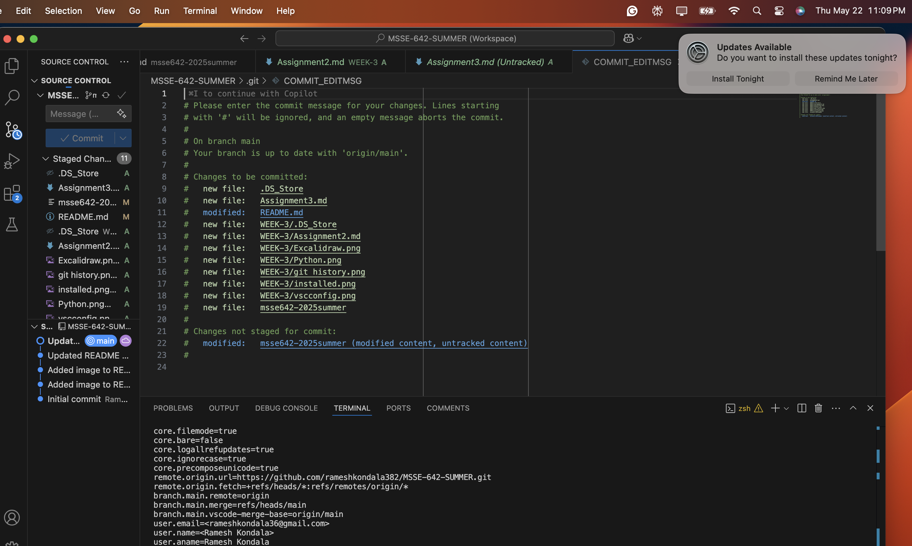

# ASSIGNMENT #2

## ACTIVITY 1: Configure Visual Studio Code (VSC)
Visual studio code configuratioln

Visual Studio Code Extensions:
    1. Excalidraw
    

    2. Git History
    

    3. Python (and any other Python extensions you might want)

    4. Total Installed

## ACTIVITY 2: Clone the class repo and add to your VSC Workspace

Two repositories:

repositories source control

## ACTIVITY 3: Writing a good readme file  

A good README document is the essential entry point for any software project, providing clear, concise, and structured information to help users and contributors understand, install, and use the project effectively. It serves as both documentation and a marketing tool, making the project approachable for newcomers and maintainable for collaborators.
Key Elements of a Good README
1. Project Title and Description
	•	Clearly state the project name at the top.
	•	Provide a brief overview of what the project does, its main features, and its purpose.
2. Motivation and Problem Statement
	•	Explain why the project exists and what problem it solves.
	•	Share the motivation or background behind the project.
3. Table of Contents
	•	Helps users navigate the document easily.
4. Installation Instructions
	•	Step-by-step guidance on how to install or set up the project, including prerequisites and dependencies.
5. Usage Examples
	•	Show how to use the project with code snippets, screenshots, or command-line examples.
6. Configuration and Setup
	•	Information on how to configure the software, including environment variables or configuration files if needed.
7. Project Structure or Repository Overview
	•	Outline the directory structure and explain the purpose of key files and folders.
8. Contribution Guidelines
	•	Instructions for contributing to the project, such as coding standards, pull request process, and code of conduct.
9. License
	•	Specify the license under which the project is distributed.
10. Authors and Acknowledgments
	•	List the project’s main contributors and give credit where due.
11. Contact Information
	•	Provide ways to reach the maintainers (email, social media, bug tracker).
12. Troubleshooting and FAQ
	•	Common issues and solutions, or links to more detailed troubleshooting documentation.
13. Links to Related Resources
	•	Documentation, tutorials, related projects, or external references.
14. Badges and Project Status
	•	Add badges for build status, license, version, and other relevant project metrics.
15. Known Issues and Roadmap
	•	List any known bugs, limitations, or planned features.
**Best Practices**
****	•	Use clear, friendly, and active language to engage users.
	•	Keep sections concise, but provide links to more detailed documentation as needed.
	•	Format the README for readability, using Markdown for headings, lists, and code blocks.
	•	Regularly update the README as the project evolves to ensure accuracy.
**Summary**
A well-crafted README includes a project overview, installation and usage instructions, contribution guidelines, licensing, and contact information, among other helpful sections. It should be easy to read, up-to-date, and tailored to the project’s audience, ensuring anyone can quickly understand and start using or contributing to the software.