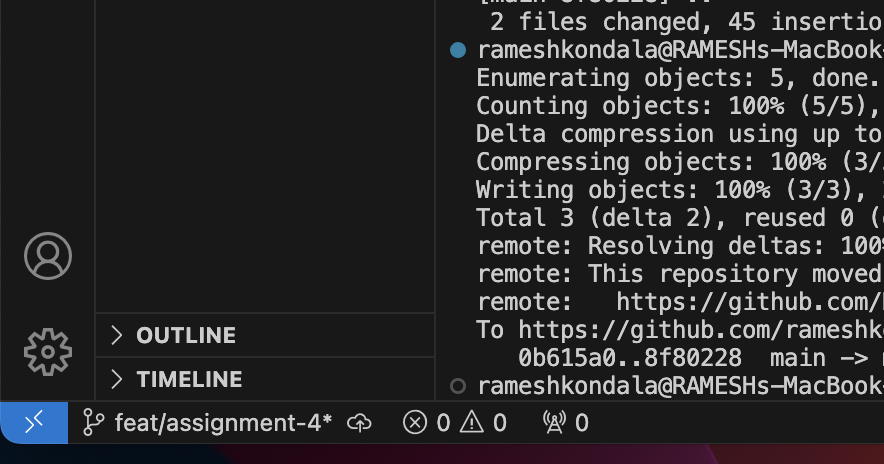
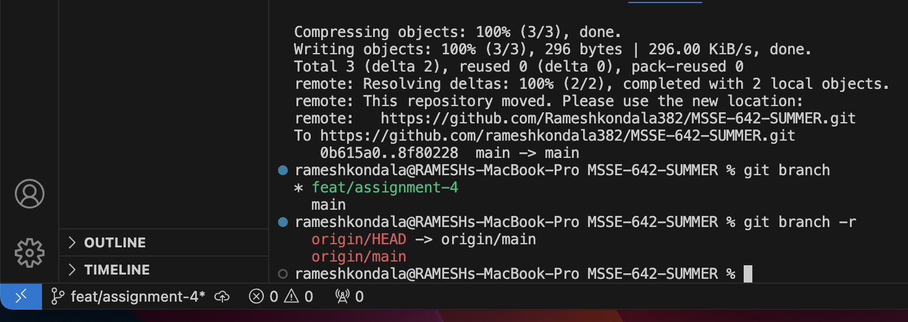
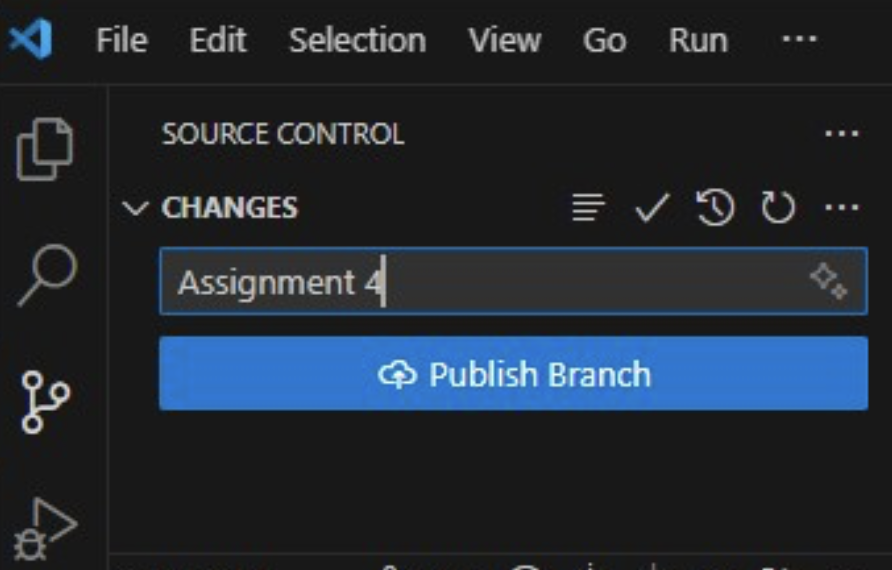
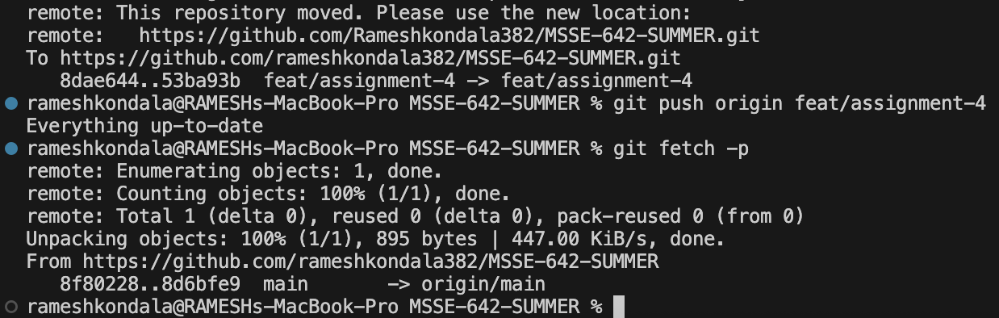

**Step 1: Created a New Feature Branch
**

I created a feature branch using Visual Studio Code by clicking the branch icon in the bottom left and selecting + Create new branch.
I named the branch: feat/assignment4 before adding new branch

**after adding used the CLI, to see the local and remote branches.
**

**Committed  changes to the local repo branch and then publish to the remote repo.
**

**What is different when you run git branch and git branch -r?
**

| Command         | Lists                    | Scope        |
| --------------- | ------------------------ | ------------ |
| `git branch`    | Local branches           | Local only   |
| `git branch -r` | Remote-tracking branches | Remote only  |
| `git branch -a` | Both local and remote    | All branches |

** issued a pull request to merge  feature branch on the remote repo
**

 

 Yes, the local feature branch is still exist

** Deleted Remote Branch**

